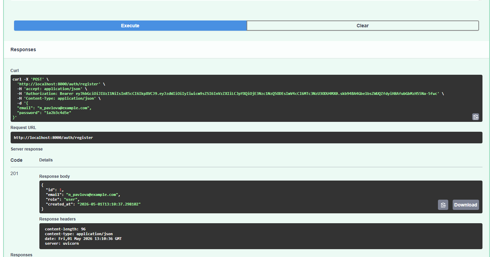
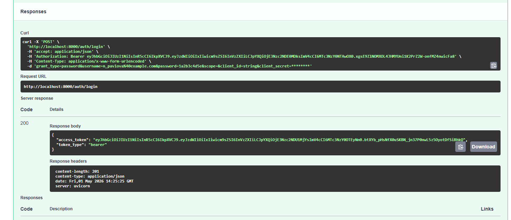
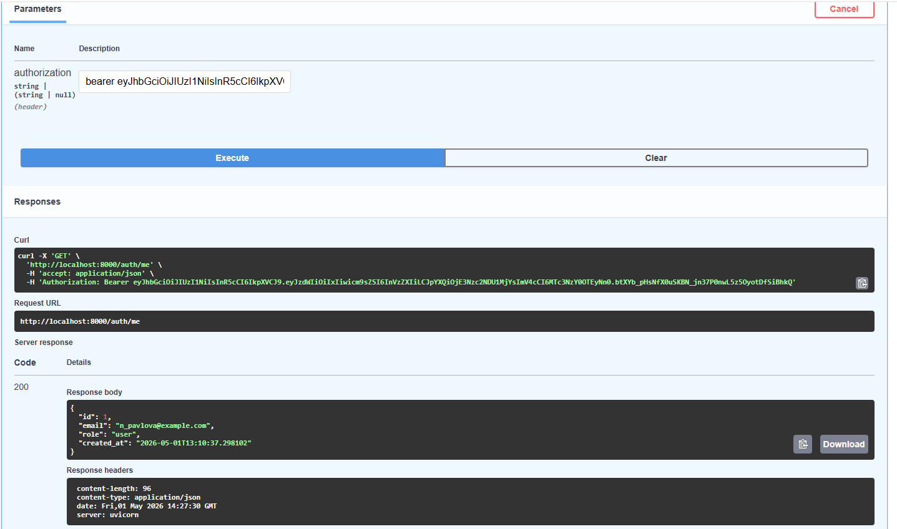
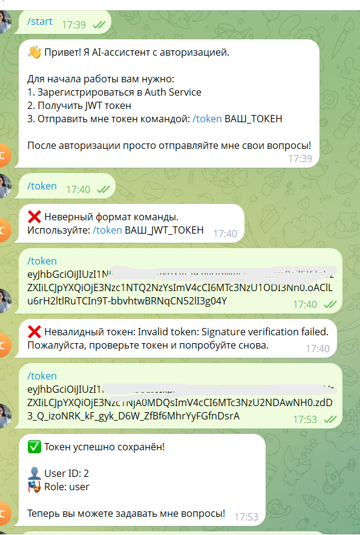
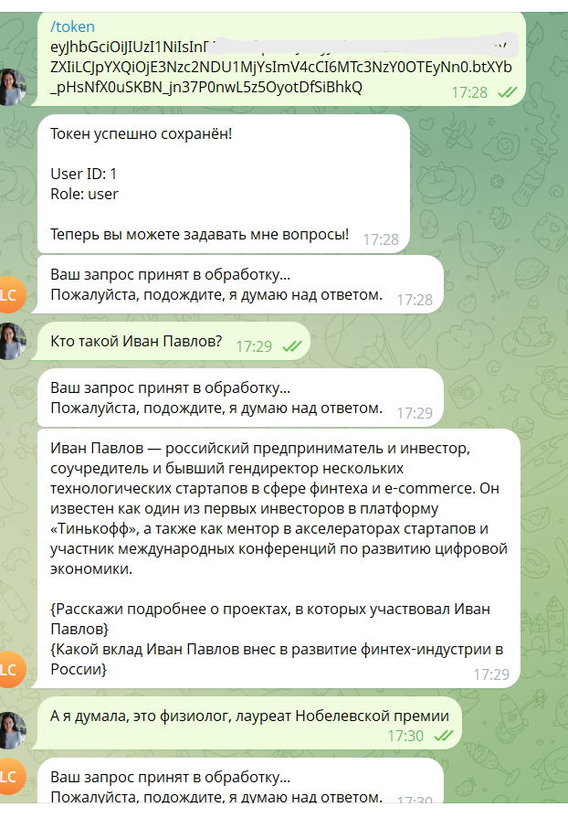
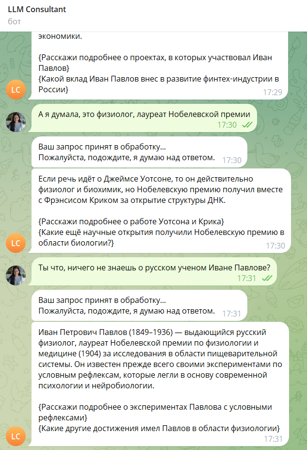
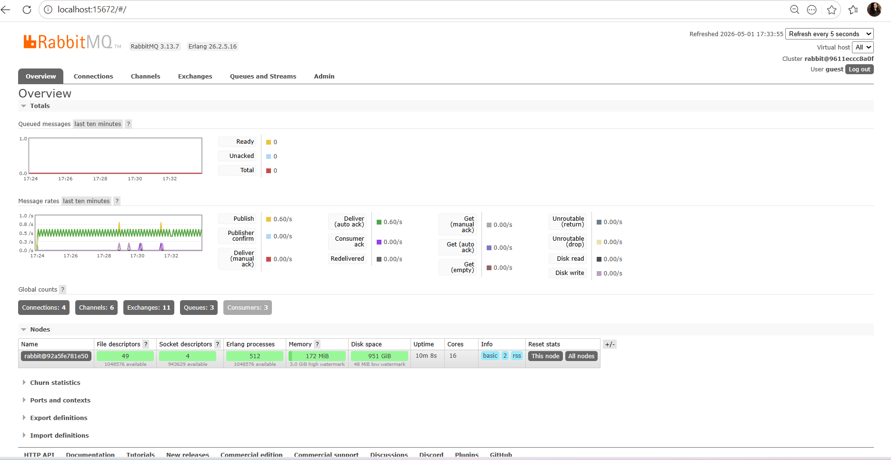
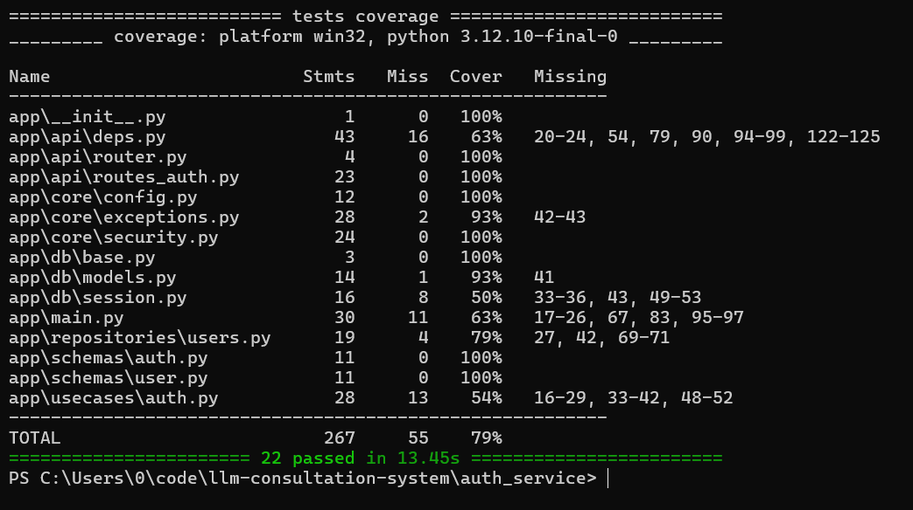
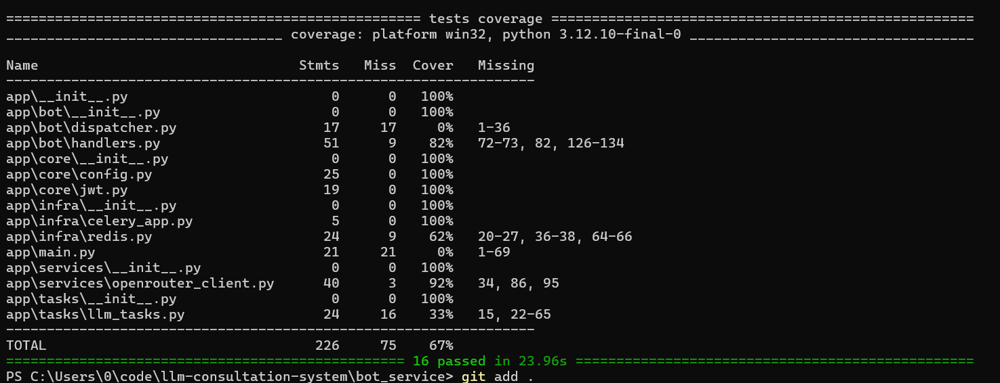

# Двухсервисная система LLM-консультаций

Проект представляет собой микросервисную систему для консультаций с использованием ИИ.
Реализована асинхронная архитектура с разделением зон ответственности и контейнеризацией через Docker.

## Структура проекта
```text
llm-consultation-system/
├── auth_service/              # Микросервис авторизации (FastAPI)
│   ├── app/                   # Исходный код сервиса
│   │   ├── api/               # Роуты и зависимости
│   │   ├── core/              # Конфигурация и безопасность
│   │   ├── db/                # База данных и модели
│   │   ├── repositories/      # Работа с данными
│   │   ├── schemas/           # Pydantic модели
│   │   └── usecases/          # Бизнес-логика
│   ├── tests/                 # Тесты сервиса авторизации
│   ├── Dockerfile             # Инструкция сборки
│   └── pyproject.toml         # Зависимости сервиса
├── bot_service/               # Микросервис Telegram-бота (Aiogram)
│   ├── app/                   # Исходный код бота
│   │   ├── bot/               # Хендлеры и диспетчер
│   │   ├── core/              # Настройки и JWT-логика
│   │   ├── infra/             # Настройки Redis и Celery
│   │   ├── services/          # Клиенты внешних API
│   │   └── tasks/             # Фоновые задачи (Celery)
│   ├── tests/                 # Тесты бота и воркера
│   ├── bot_runner.py          # Точка входа для запуска бота
│   ├── Dockerfile             # Инструкция сборки
│   └── pyproject.toml         # Зависимости сервиса
├── screenshots/               # Скриншоты работы системы для отчета
├── docker-compose.yml         # Оркестрация всей системы
├── .gitignore                 # Список исключений для Git
└── README.md                  # Документация проекта
```

## Архитектура и сервисы
Система состоит из независимых компонентов:

1. **Auth Service (FastAPI)**: 
   - Регистрация (формат email: `surname@email.com`).
   - Выдача JWT-токенов.
   - Эндпоинт `/auth/me` для проверки текущей сессии.
2. **Bot Service (Aiogram 3)**:
   - Принимает токен и привязывает его к Telegram ID через **Redis**.
   - Передает вопросы пользователей в очередь **RabbitMQ**.
3. **Celery Worker**:
   - Асинхронно обрабатывает задачи из очереди.
   - Выполняет запросы к **OpenRouter API** и возвращает ответ в бот.

## Пользовательский сценарий
1. Регистрация в **Auth Service** через Swagger (`localhost:8000/docs`).
2. Вход (Login) и получение **JWT-токена**.
3. В Telegram-боте ввод команды `/token <ваш_jwt>`.
4. Отправка вопроса боту - ответ приходит асинхронно через Celery.

Согласно требованиям, email оформляется в формате `surname@email.com`
(на скриншотах ниже продемонстрирована регистрация пользователя `n_pavlova@example.com`).

## Демонстрация работы

### 1. Auth Service (Swagger)
Регистрация пользователя, получение JWT-токена и проверка через эндпоинт /auth/me:

* **Регистрация** (формат surname@email.com):


* **Авторизация (Login)** и получение токена:


* **Проверка текущего пользователя** (/auth/me):


### 2. Работа Telegram-бота
Полный цикл взаимодействия: активация токена, отправка вопроса и асинхронный ответ от ИИ.

* **Активация токена** (команда `/token <jwt>`):


* **Отправка вопроса, принятие задачи в очередь, получение ответа от LLM - 1**:


* **Отправка вопроса, принятие задачи в очередь, и получение ответа LMM- 2**:


### 3. Интерфейс RabbitMQ
Подтверждение работы очередей и наличие активных потребителей (consumers):


### 4. Тестирование
Для Unit-тестирования логики без внешних зависимостей использовались **fakeredis** (для Redis) и **respx** (для мокинга API OpenRouter).
Тесты проходят локально без Docker.

* **Тесты Auth Service** (22 passed, 79% coverage):


* **Тесты Bot Service** (16 passed, 67% coverage):


## Запуск проекта
```bash
docker-compose up --build
```
## Настройка окружения
Для работы системы необходимо создать файл `.env` в корне проекта. 

**Важное примечание по LLM:** 
На момент разработки и успешного тестирования (1 мая 2026) использовалась модель: 
`OPENROUTER_MODEL=openai/gpt-oss-120b:free`

В случае, если данная модель станет недоступна в OpenRouter, её можно заменить на любую другую актуальную модель с пометкой `:free` в настройках окружения.

### Security Note
Вся история коммитов была 02.05.2026 принудительно очищена (`force push`) в связи с компрометацией секретных ключей (API Token и JWT Secret) в одном из промежуточных этапов разработки. Все небезопасные ключи отозваны и заменены на новые.

## Автор
**Павлова Наталья Геннадьевна** 
*М25-555*